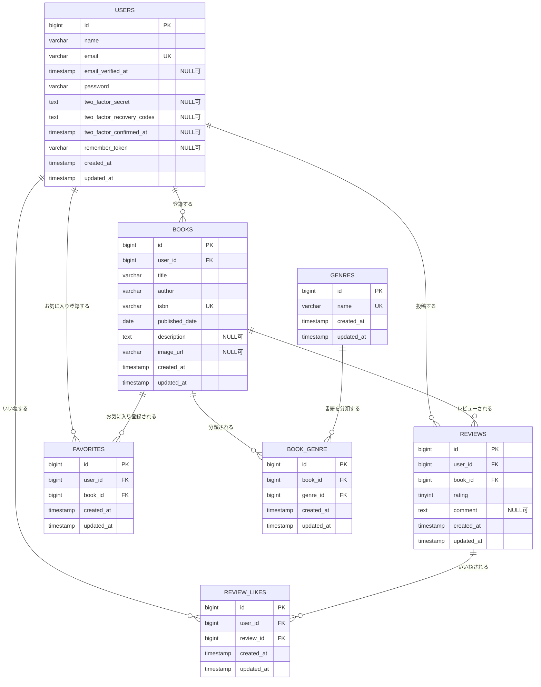

# BookShelf 書籍レビューアプリ

## 概要

BookShelfは、書籍の登録・閲覧・レビュー投稿を行える書籍レビューアプリケーションです。

ユーザーは書籍の登録・検索・レビュー投稿・お気に入り登録を行うことができ、
ジャンル分類やランキング機能も備えています。

また、外部アプリケーション向けの公開APIを提供しています。

---

## 作成者

新海　圭一郎

---

## 使用技術

| 項目         | 使用技術        |
| ------------ | --------------- |
| PHP          | 8.2             |
| Laravel      | 10.50.2         |
| MySQL        | 8.0             |
| Nginx        | latest          |
| Laravel Sail | latest          |
| Docker       | latest          |
| Blade        | -               |
| Tailwind CSS | 3.4             |
| Alpine.js    | latest          |
| Vite         | latest          |
| Fortify      | Laravel Fortify |
| phpMyAdmin   | latest          |

---

## ER図

## ER図



### 複合ユニーク制約

| テーブル       | 対象カラム             | 内容                             |
| -------------- | ---------------------- | -------------------------------- |
| `book_genre`   | `book_id`, `genre_id`  | 同じ書籍とジャンルの重複を禁止   |
| `reviews`      | `user_id`, `book_id`   | 1ユーザーにつき1冊1レビュー      |
| `review_likes` | `user_id`, `review_id` | 同じレビューへの重複いいねを禁止 |
| `favorites`    | `user_id`, `book_id`   | 同じ書籍の重複お気に入りを禁止   |

---

## 開発環境URL

| サービス         | URL                   |
| ---------------- | --------------------- |
| アプリケーション | http://localhost      |
| phpMyAdmin       | http://localhost:8080 |

---

## 動作環境

- Docker Desktop
- Git
- Docker Compose
- Laravel Sail

---

## 環境構築

### 1. リポジトリをクローン

```bash
git clone　https://github.com/kei-aichi/bookshelf-app.git
```

```bash
cd bookshelf-app
```

### 2. .env作成

```bash
cp .env.example .env
```

### 3. Composerインストール

```bash
composer install
```

### 4. アプリケーションキー生成

```bash
sail artisan key:generate
```

### 5. Sail起動

```bash
sail up -d
```

### 6. npmパッケージインストール

```bash
sail npm install
```

### 7. Vite起動

```bash
sail npm run dev
```

### 8. マイグレーション

```bash
sail artisan migrate --seed
```

---

## テスト実行

### Feature / Unitテスト

```bash
sail artisan test
```

---

## 機能一覧

### 基本機能

- 会員登録・ログイン
- 書籍CRUD
- レビューCRUD
- ジャンル管理
- お気に入り機能
- ランキング機能
- 読書計画管理
- 通知機能

### 応用機能

- Google Books API連携
- 高度な検索
- Laravel SanctumによるAPI認証
- 読書レポート
- リマインダー通知

---

## APIエンドポイント

| Method | URI             | 内容         |
| ------ | --------------- | ------------ |
| GET    | /api/books      | 書籍一覧取得 |
| GET    | /api/books/{id} | 書籍詳細取得 |
| POST   | /api/books      | 書籍登録     |
| PUT    | /api/books/{id} | 書籍更新     |
| DELETE | /api/books/{id} | 書籍削除     |
