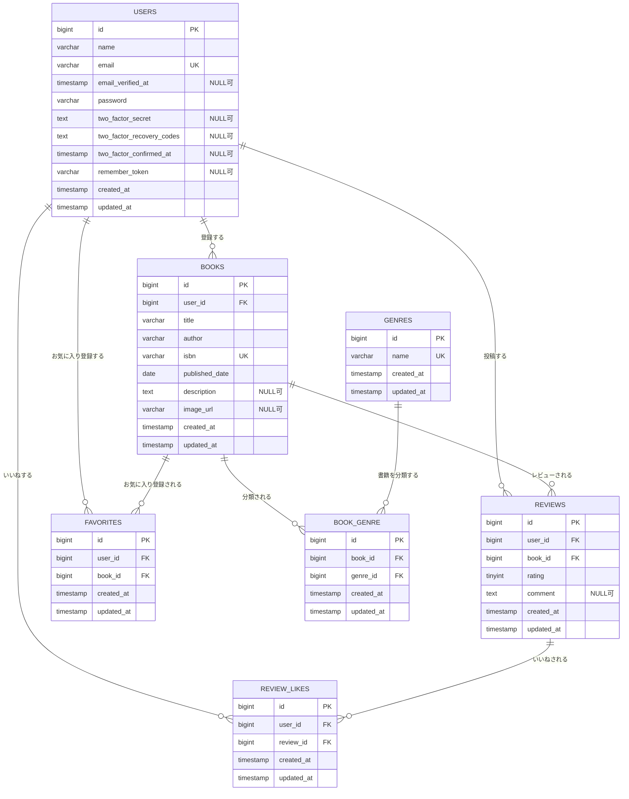

# BookShelf 書籍レビューアプリ

## 概要

BookShelfは、書籍の登録・閲覧・レビュー投稿を行える書籍レビューアプリケーションです。

ユーザーは書籍の登録・検索・レビュー投稿・お気に入り登録を行うことができ、
ジャンル分類やランキング機能も備えています。

また、外部アプリケーション向けの公開APIを提供しています。

---

## 作成者

新海　圭一郎

---

## 使用技術

| 項目                  | 使用技術                |
| --------------------- | ----------------------- |
| PHP                   | 8.2                     |
| Laravel               | 10.50.2                 |
| MySQL                 | 8.0                     |
| Nginx                 | latest                  |
| Laravel Sail          | latest                  |
| Docker                | latest                  |
| Blade                 | -                       |
| Tailwind CSS          | 3.4                     |
| Alpine.js             | latest                  |
| Vite                  | latest                  |
| Laravel Fortify       | Web認証                 |
| Laravel Sanctum       | API認証（Bearer Token） |
| Laravel Notifications | Database Channel        |
| PHP Enum              | 読書状態管理            |
| Google Books API      | ISBNによる書籍情報取得  |
| phpMyAdmin            | latest                  |

---

## 要件追記事項

要件書に詳細な記載がなかった箇所について、アプリの仕様やユーザーの操作性を考慮し、以下の内容を追加で実装しました。

### ジャンル削除時の制限

削除対象のジャンルしか紐付いていない書籍が存在する場合は、そのジャンルを削除できないように実装しました。

書籍は必ず1つ以上のジャンルを持つ仕様のため、ジャンル削除によって、書籍がジャンルを持たない不整合な状態になることを防ぐためです。

### お気に入り解除後の画面遷移

お気に入り一覧画面でお気に入りを解除した際、解除した書籍の詳細画面へ遷移し、「お気に入りを解除しました」というフラッシュメッセージを表示するように実装しました。

これにより、ユーザーがどの書籍をお気に入りから解除したのかを確認でき、誤って解除した場合でも、書籍詳細画面からすぐに再登録できるようにしています。

### 読書計画の状態遷移と操作ボタン

読書計画の進捗状況が直感的に分かるよう、計画状態に応じて操作ボタンを切り替える設計としました。

- 読書計画作成時
    - 状態：「開始前」
    - 操作：「読書開始」「編集」「削除」

- 「読書開始」を押した場合
    - 状態を「開始前」から「進行中」に変更
    - 操作を「読了する」「編集」「削除」に切り替え

- 「読了する」を押した場合
    - 状態を「進行中」から「読了」に変更
    - 読了日時（completed_at）を自動保存

「読書開始」と「読了する」を別々に表示するのではなく、
現在の読書状態に応じて同じ進捗操作のボタンを切り替えることで、
ユーザーが次に行う操作を分かりやすくしています。

---

## テーブル設計

| テーブル名    | 説明                         |
| ------------- | ---------------------------- |
| users         | ユーザー情報                 |
| books         | 書籍情報                     |
| genres        | ジャンル情報                 |
| book_genre    | 書籍とジャンルの中間テーブル |
| reviews       | レビュー情報                 |
| review_likes  | レビューへのいいね           |
| favorites     | お気に入り情報               |
| reading_plans | 読書計画（応用機能）         |
| notifications | 通知（応用機能）             |

※ 詳細なリレーションはER図を参照してください。

---

## ER図


```mermaid
erDiagram
    USERS ||--o{ BOOKS : "登録する"
    USERS ||--o{ REVIEWS : "投稿する"
    USERS ||--o{ FAVORITES : "お気に入り登録する"
    USERS ||--o{ REVIEW_LIKES : "いいねする"

    BOOKS ||--o{ REVIEWS : "レビューされる"
    BOOKS ||--o{ FAVORITES : "お気に入り登録される"
    BOOKS ||--o{ BOOK_GENRE : "分類される"

    GENRES ||--o{ BOOK_GENRE : "書籍を分類する"

    REVIEWS ||--o{ REVIEW_LIKES : "いいねされる"

    USERS {
        bigint id PK
        varchar name
        varchar email UK
        timestamp email_verified_at "NULL可"
        varchar password
        text two_factor_secret "NULL可"
        text two_factor_recovery_codes "NULL可"
        timestamp two_factor_confirmed_at "NULL可"
        varchar remember_token "NULL可"
        timestamp created_at
        timestamp updated_at
    }

    BOOKS {
        bigint id PK
        bigint user_id FK
        varchar title
        varchar author
        varchar isbn UK
        date published_date
        text description "NULL可"
        varchar image_url "NULL可"
        timestamp created_at
        timestamp updated_at
    }

    GENRES {
        bigint id PK
        varchar name UK
        timestamp created_at
        timestamp updated_at
    }

    BOOK_GENRE {
        bigint id PK
        bigint book_id FK
        bigint genre_id FK
        timestamp created_at
        timestamp updated_at
    }

    REVIEWS {
        bigint id PK
        bigint user_id FK
        bigint book_id FK
        tinyint rating
        text comment "NULL可"
        timestamp created_at
        timestamp updated_at
    }

    REVIEW_LIKES {
        bigint id PK
        bigint user_id FK
        bigint review_id FK
        timestamp created_at
        timestamp updated_at
    }

    FAVORITES {
        bigint id PK
        bigint user_id FK
        bigint book_id FK
        timestamp created_at
        timestamp updated_at
    }
```

### 複合ユニーク制約

| テーブル       | 対象カラム             | 内容                             |
| -------------- | ---------------------- | -------------------------------- |
| `book_genre`   | `book_id`, `genre_id`  | 同じ書籍とジャンルの重複を禁止   |
| `reviews`      | `user_id`, `book_id`   | 1ユーザーにつき1冊1レビュー      |
| `review_likes` | `user_id`, `review_id` | 同じレビューへの重複いいねを禁止 |
| `favorites`    | `user_id`, `book_id`   | 同じ書籍の重複お気に入りを禁止   |

---

## 開発環境URL

| サービス         | URL                   |
| ---------------- | --------------------- |
| アプリケーション | http://localhost      |
| phpMyAdmin       | http://localhost:8080 |

---

## 動作環境

- Docker Desktop
- Git
- Docker Compose
- Laravel Sail

---

## 環境構築

### 1. リポジトリをクローン

```bash
git clone　https://github.com/kei-aichi/bookshelf-app.git
```

```bash
cd bookshelf-app
```

### 2. .env作成

```bash
cp .env.example .env
```

### 3. Composerインストール

```bash
composer install
```

### 4. アプリケーションキー生成

```bash
sail artisan key:generate
```

### 5. Sail起動

```bash
sail up -d
```

### 6. npmパッケージインストール

```bash
sail npm install
```

### 7. Vite起動

```bash
sail npm run dev
```

### 8. マイグレーション

```bash
sail artisan migrate --seed
```

---

## サンプルログイン情報

DatabaseSeeder実行時に、以下のテストユーザーを作成します。

| ユーザー名 | メールアドレス        | パスワード |
| ---------- | --------------------- | ---------- |
| 山田 太郎  | yamada@example.com    | password   |
| 鈴木 花子  | suzuki@example.com    | password   |
| 田中 一郎  | tanaka@example.com    | password   |
| 佐藤 次郎  | sato@example.com      | password   |
| 高橋 健太  | takahashi@example.com | password   |

※ パスワードは全ユーザー共通で `password` です。

---

## テスト実行

### Feature / Unitテスト

```bash
sail artisan test
```

---

## 読書計画リマインダー通知の動作確認

読書計画のリマインダー通知は、読書期日（`target_date`）を基準に以下のタイミングで通知されます。

- 期日の3日前
- 期日当日
- 期日の3日後

### 動作確認手順

1. 読書計画を作成します。

2. `reading_plans` テーブルの対象レコードの `target_date` を、確認したい通知タイミングに合わせて変更します。
    - 3日前通知を確認する場合：現在日から3日後の日付
    - 当日通知を確認する場合：現在日
    - 3日後通知を確認する場合：現在日から3日前の日付

3. ターミナルで以下のコマンドを実行します。

```bash
sail artisan reading-plans:send-reminders
```

4. アプリケーションの通知一覧画面を開き、対象のリマインダー通知が表示されることを確認します。

5. 同じ条件のまま再度コマンドを実行し、同一の読書計画・同一タイミングの通知が重複して作成されないことを確認します。

### Schedulerの確認

リマインダーコマンドはLaravel Schedulerに登録しており、定期的に実行される設定です。

Schedulerへの登録状況は以下のコマンドで確認できます。

```bash
sail artisan schedule:list
```

---

## 機能一覧

### 基本機能

- 会員登録・ログイン
- 書籍CRUD
- レビューCRUD
- ジャンル管理
- お気に入り機能
- ランキング機能
- 読書計画管理
- 通知機能

### 応用機能

- Google Books API連携
- 高度な検索
- Laravel SanctumによるAPI認証
- 読書レポート
- リマインダー通知

---

## APIエンドポイント

### 公開API

| Method | URI                |  認証   | 内容         |
| ------ | ------------------ | :-----: | ------------ |
| GET    | /api/v1/books      |  不要   | 書籍一覧取得 |
| GET    | /api/v1/books/{id} |  不要   | 書籍詳細取得 |
| POST   | /api/v1/books      | Sanctum | 書籍登録     |
| PUT    | /api/v1/books/{id} | Sanctum | 書籍更新     |
| DELETE | /api/v1/books/{id} | Sanctum | 書籍削除     |

### 外部API連携

| Method | URI                | 内容                                             |
| ------ | ------------------ | ------------------------------------------------ |
| GET    | /books/isbn/{isbn} | Google Books APIを利用してISBNから書籍情報を取得 |

### 認証

- Web認証：Laravel Fortify
- API認証：Laravel Sanctum（Bearer Token）
