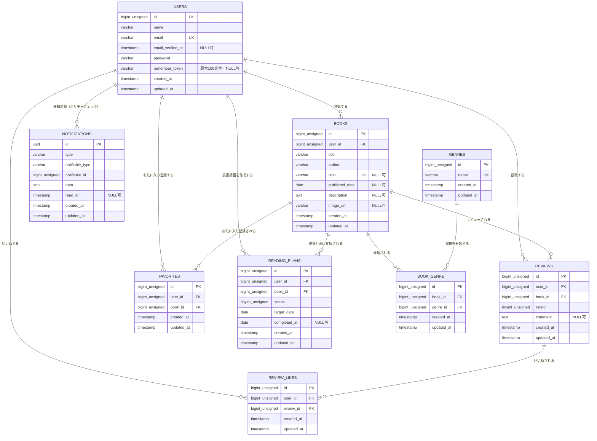

# BookShelf 書籍レビューアプリ

## 概要

BookShelfは、書籍の登録・閲覧・レビュー投稿を行える書籍レビューアプリケーションです。

ユーザーは書籍の登録・検索・レビュー投稿・お気に入り登録を行うことができ、
ジャンル分類やランキング機能も備えています。

また、外部アプリケーション向けの公開APIを提供しています。

---

## 作成者

新海　圭一郎

---

## 使用技術

| 項目                  | 使用技術                |
| --------------------- | ----------------------- |
| PHP                   | 8.5                     |
| Laravel               | 10.50.2                 |
| MySQL                 | 8.4                     |
| Nginx                 | latest                  |
| Laravel Sail          | latest                  |
| Docker                | latest                  |
| Blade                 | -                       |
| Tailwind CSS          | 3.4                     |
| Alpine.js             | latest                  |
| Vite                  | latest                  |
| Laravel Fortify       | Web認証                 |
| Laravel Sanctum       | API認証（Bearer Token） |
| Laravel Notifications | Database Channel        |
| PHP Enum              | 読書状態管理            |
| Google Books API      | ISBNによる書籍情報取得  |
| phpMyAdmin            | latest                  |

---

## 要件追記事項

要件書に詳細な記載がなかった箇所について、アプリの仕様やユーザーの操作性を考慮し、以下の内容を追加で実装しました。

### ジャンル削除時の制限

削除対象のジャンルしか紐付いていない書籍が存在する場合は、そのジャンルを削除できないように実装しました。

書籍は必ず1つ以上のジャンルを持つ仕様のため、ジャンル削除によって、書籍がジャンルを持たない不整合な状態になることを防ぐためです。

### お気に入り解除後の画面遷移

お気に入り一覧画面でお気に入りを解除した際、解除した書籍の詳細画面へ遷移し、「お気に入りを解除しました」というフラッシュメッセージを表示するように実装しました。

これにより、ユーザーがどの書籍をお気に入りから解除したのかを確認でき、誤って解除した場合でも、書籍詳細画面からすぐに再登録できるようにしています。

### 読書計画の状態遷移と操作ボタン

読書計画の進捗状況が直感的に分かるよう、計画状態に応じて操作ボタンを切り替える設計としました。

- 読書計画作成時
    - 状態：「開始前」
    - 操作：「読書開始」「編集」「削除」

- 「読書開始」を押した場合
    - 状態を「開始前」から「進行中」に変更
    - 操作を「読了する」「編集」「削除」に切り替え

- 「読了する」を押した場合
    - 状態を「進行中」から「読了」に変更
    - 読了日時（completed_at）を自動保存

「読書開始」と「読了する」を別々に表示するのではなく、
現在の読書状態に応じて同じ進捗操作のボタンを切り替えることで、
ユーザーが次に行う操作を分かりやすくしています。

---

## テーブル設計

| テーブル名    | 説明                         |
| ------------- | ---------------------------- |
| users         | ユーザー情報                 |
| books         | 書籍情報                     |
| genres        | ジャンル情報                 |
| book_genre    | 書籍とジャンルの中間テーブル |
| reviews       | レビュー情報                 |
| review_likes  | レビューへのいいね           |
| favorites     | お気に入り情報               |
| reading_plans | 読書計画（応用機能）         |
| notifications | 通知（応用機能）             |

※ 詳細なリレーションはER図を参照してください。

---

## ER図


```mermaid
erDiagram
    USERS ||--o{ BOOKS : "登録する"
    USERS ||--o{ REVIEWS : "投稿する"
    USERS ||--o{ FAVORITES : "お気に入り登録する"
    USERS ||--o{ REVIEW_LIKES : "いいねする"
    USERS ||--o{ READING_PLANS : "読書計画を作成する"
    USERS ||--o{ NOTIFICATIONS : "通知対象（ポリモーフィック）"

    BOOKS ||--o{ REVIEWS : "レビューされる"
    BOOKS ||--o{ FAVORITES : "お気に入り登録される"
    BOOKS ||--o{ BOOK_GENRE : "分類される"
    BOOKS ||--o{ READING_PLANS : "読書計画に登録される"

    GENRES ||--o{ BOOK_GENRE : "書籍を分類する"

    REVIEWS ||--o{ REVIEW_LIKES : "いいねされる"

    USERS {
        bigint_unsigned id PK
        varchar name
        varchar email UK
        timestamp email_verified_at "NULL可"
        varchar password
        varchar remember_token "最大100文字・NULL可"
        timestamp created_at
        timestamp updated_at
    }

    BOOKS {
        bigint_unsigned id PK
        bigint_unsigned user_id FK
        varchar title
        varchar author
        varchar isbn UK "NULL可"
        date published_date "NULL可"
        text description "NULL可"
        varchar image_url "NULL可"
        timestamp created_at
        timestamp updated_at
    }

    GENRES {
        bigint_unsigned id PK
        varchar name UK
        timestamp created_at
        timestamp updated_at
    }

    BOOK_GENRE {
        bigint_unsigned id PK
        bigint_unsigned book_id FK
        bigint_unsigned genre_id FK
        timestamp created_at
        timestamp updated_at
    }

    REVIEWS {
        bigint_unsigned id PK
        bigint_unsigned user_id FK
        bigint_unsigned book_id FK
        tinyint_unsigned rating
        text comment "NULL可"
        timestamp created_at
        timestamp updated_at
    }

    REVIEW_LIKES {
        bigint_unsigned id PK
        bigint_unsigned user_id FK
        bigint_unsigned review_id FK
        timestamp created_at
        timestamp updated_at
    }

    FAVORITES {
        bigint_unsigned id PK
        bigint_unsigned user_id FK
        bigint_unsigned book_id FK
        timestamp created_at
        timestamp updated_at
    }

    READING_PLANS {
        bigint_unsigned id PK
        bigint_unsigned user_id FK
        bigint_unsigned book_id FK
        tinyint_unsigned status
        date target_date
        date completed_at "NULL可"
        timestamp created_at
        timestamp updated_at
    }

    NOTIFICATIONS {
        uuid id PK
        varchar type
        varchar notifiable_type
        bigint_unsigned notifiable_id
        json data
        timestamp read_at "NULL可"
        timestamp created_at
        timestamp updated_at
    }
```

### 複合ユニーク制約

| テーブル       | 対象カラム             | 内容                             |
| -------------- | ---------------------- | -------------------------------- |
| `book_genre`   | `book_id`, `genre_id`  | 同じ書籍とジャンルの重複を禁止   |
| `reviews`      | `user_id`, `book_id`   | 1ユーザーにつき1冊1レビュー      |
| `review_likes` | `user_id`, `review_id` | 同じレビューへの重複いいねを禁止 |
| `favorites`    | `user_id`, `book_id`   | 同じ書籍の重複お気に入りを禁止   |

---

## 開発環境URL

| サービス         | URL                   |
| ---------------- | --------------------- |
| アプリケーション | http://localhost      |
| phpMyAdmin       | http://localhost:8080 |

---

## 動作環境

- Docker Desktop
- Git
- Docker Compose
- Laravel Sail
- PHP 8.1以上
- Composer

---

## 環境構築

### 1. リポジトリをクローン

```bash
git clone https://github.com/kei-aichi/bookshelf-app.git
```

```bash
cd bookshelf-app
```

### 2. .env作成・外部API設定

```bash
cp .env.example .env
```

Google CloudでGoogle Books APIを有効化してAPIキーを発行し、`.env` の以下の項目へ設定します。

```env
GOOGLE_BOOKS_API_KEY=発行したAPIキー
```

この設定は、書籍登録・編集画面でISBNから書籍情報を取得するために使用します。APIキーは公開リポジトリへコミットしないでください。

### 3. Composerインストール

```bash
composer install
```

### 4. Sail起動

以降のコマンドを短い`sail`形式で実行できるよう、現在のターミナルでエイリアスを設定します。

```bash
alias sail='./vendor/bin/sail'
```

このエイリアスは、設定したターミナルを閉じると解除されます。新しいターミナルを開いた場合は、プロジェクトディレクトリへ移動して同じコマンドを再度実行してください。

Sailをバックグラウンドで起動します。

```bash
sail up -d
```

### 5. アプリケーションキー生成

```bash
sail artisan key:generate
```

### 6. npmパッケージインストール

```bash
sail npm install
```

### 7. Vite起動

Viteは起動中のままになるため、ここからは別のターミナルを開いて実行します。

新しいターミナルでプロジェクトディレクトリへ移動し、Sailのエイリアスを設定します。

```bash
cd bookshelf-app
alias sail='./vendor/bin/sail'
```

続けてViteを起動し、このターミナルは開いたままにします。

```bash
sail npm run dev
```

### 8. マイグレーション

```bash
sail artisan migrate --seed
```

---

## サンプルログイン情報

DatabaseSeeder実行時に、以下のテストユーザーを作成します。

| ユーザー名 | メールアドレス        | パスワード |
| ---------- | --------------------- | ---------- |
| 山田 太郎  | yamada@example.com    | password   |
| 鈴木 花子  | suzuki@example.com    | password   |
| 田中 一郎  | tanaka@example.com    | password   |
| 佐藤 次郎  | sato@example.com      | password   |
| 高橋 健太  | takahashi@example.com | password   |

※ パスワードは全ユーザー共通で `password` です。

### 動作確認用の推奨アカウント

採点・動作確認では、以下のアカウントでのログインを推奨します。

| ユーザー名 | メールアドレス     | パスワード |
| ---------- | ------------------ | ---------- |
| 山田 太郎  | yamada@example.com | password   |

山田太郎のアカウントには、開始前・進行中・読了の各状態の読書計画や、
読書レポート・リマインダー通知を確認するためのサンプルデータが登録されています。

特に以下の応用機能は、山田太郎でログインすると確認しやすくなっています。

- 読書計画の状態別表示と絞り込み
- 読書開始・読了操作
- マイ読書レポート
- 期日3日前・当日・3日後のリマインダー通知

書籍の所有者はサンプルデータ作成時にランダムで決まるため、
書籍の編集・削除は、山田太郎で新しく登録した書籍を使って確認してください。

---

## テスト実行

### Feature / Unitテスト

```bash
sail artisan test
```

---

## 読書計画リマインダー通知の動作確認

読書計画のリマインダー通知は、読書期日（`target_date`）を基準に以下のタイミングで通知されます。

- 期日の3日前
- 期日当日
- 期日の3日後

### 動作確認手順

初期データには、山田太郎（`yamada@example.com`）の「進行中」の読書計画として、以下の3件が登録されています。そのため、読書計画の新規作成や日付変更は不要です。

- 期日が現在日から3日後の計画（3日前通知用）
- 期日が現在日の計画（当日通知用）
- 期日が現在日から3日前の計画（3日後通知用）

1. 初期データを投入済みの環境で、ターミナルから以下のコマンドを実行します。

```bash
sail artisan reading-plans:send-reminders
```

2. 山田太郎でログインし、通知一覧画面に3種類のリマインダー通知が表示されることを確認します。

3. 同じ条件のまま再度コマンドを実行し、同一の読書計画・同一タイミングの通知が重複して作成されないことを確認します。

初期データを使用しない場合は、「進行中」の読書計画を用意し、確認したい通知タイミングに応じて期日を現在日の3日後・当日・3日前のいずれかに設定してください。

### Schedulerの確認

リマインダーコマンドはLaravel Schedulerに登録しており、定期的に実行される設定です。

Schedulerへの登録状況は以下のコマンドで確認できます。

```bash
sail artisan schedule:list
```

---

## 機能一覧

### 基本機能

- 会員登録・ログイン
- 書籍CRUD
- レビューCRUD
- ジャンル管理
- お気に入り機能
- ランキング機能

### 応用機能

- Google Books API連携
- 高度な検索
- Laravel SanctumによるAPI認証
- 読書レポート
- 読書計画管理
- 通知機能
- リマインダー通知

---

## APIエンドポイント

### 公開API

| Method | URI                |  認証   | 内容         |
| ------ | ------------------ | :-----: | ------------ |
| GET    | /api/v1/books      |  不要   | 書籍一覧取得 |
| GET    | /api/v1/books/{id} |  不要   | 書籍詳細取得 |
| POST   | /api/v1/books      | Sanctum | 書籍登録     |
| PUT    | /api/v1/books/{id} | Sanctum | 書籍更新     |
| DELETE | /api/v1/books/{id} | Sanctum | 書籍削除     |

### 外部API連携

| Method | URI                | 認証            | 内容                                             |
| ------ | ------------------ | --------------- | ------------------------------------------------ |
| GET    | /books/isbn/{isbn} | Webログイン必須 | Google Books APIを利用してISBNから書籍情報を取得 |

### ISBN検索の動作確認

書籍登録画面のISBN検索には、以下のISBNを動作確認例として使用できます。

| ISBN          |
| ------------- |
| 9784777918997 |
| 9784569856216 |

1. 山田太郎でログインします。
2. 書籍登録画面を開きます。
3. ISBN欄へ上記いずれかの13桁のISBNを入力します。
4. ISBN検索ボタンを押します。
5. Google Books APIから取得した書籍情報がフォームへ反映されることを確認します。

※ Google Books APIの登録状況や応答内容により、取得できる書籍情報が変わる場合があります。

### 認証

- Web認証：Laravel Fortify
- API認証：Laravel Sanctum（Bearer Token）

認証が必要なAPIの正常系・未認証・他ユーザーによる操作拒否は、以下のテストで確認できます。

```bash
sail artisan test tests/Feature/Api/V1/BookApiTest.php
```

### API認証用トークンの発行

認証が必要なAPIを手動で確認する場合は、Laravel TinkerでサンプルユーザーのSanctumトークンを発行します。

```bash
sail artisan tinker
```

Tinker内で以下を実行します。

```php
App\Models\User::where('email', 'yamada@example.com')->firstOrFail()->createToken('api-test')->plainTextToken;
```

`1|...` のような形式で表示された文字列がAPIトークンです。このトークンをリクエストの`Authorization`ヘッダーへ指定します。

Tinkerを終了した後、発行されたトークンをシェル変数へ設定します。

```bash
API_TOKEN='Tinkerで発行されたトークン'
```

```text
Authorization: Bearer 発行されたトークン
Accept: application/json
```

実際に発行したトークンは、READMEやGitへ記載しないでください。

### 認証付き書籍登録APIの確認

`genre_ids`には、データベースに存在するジャンルIDを指定してください。

```bash
curl -X POST http://localhost/api/v1/books \
  -H "Authorization: Bearer ${API_TOKEN}" \
  -H "Accept: application/json" \
  -H "Content-Type: application/json" \
  -d '{
    "title": "API動作確認用書籍",
    "author": "テスト著者",
    "isbn": null,
    "published_date": null,
    "description": "Sanctum認証APIの動作確認用です。",
    "image_url": null,
    "genre_ids": [1]
  }'
```

正常に登録されると、`201 Created`が返ります。更新・削除の認可を確認するときは、この操作で登録した山田太郎所有の書籍を使用してください。

### 未認証時の確認

トークンを指定せずに登録APIを呼び出すと、`401 Unauthorized`が返ります。

```bash
curl -X POST http://localhost/api/v1/books \
  -H "Accept: application/json" \
  -H "Content-Type: application/json" \
  -d '{
    "title": "未認証テスト",
    "author": "テスト著者",
    "genre_ids": [1]
  }'
```

### 発行したトークンの削除

動作確認後は、Tinkerで確認用トークンを削除できます。

```bash
sail artisan tinker
```

```php
App\Models\User::where('email', 'yamada@example.com')->firstOrFail()->tokens()->where('name', 'api-test')->delete();
```

削除したトークン数が表示されます。`1`以上なら削除成功、`0`なら対象の`api-test`トークンは存在しません。
